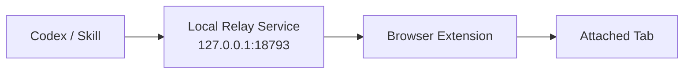

# CodexBrowserRelay

Browser relay extension and local service for Codex to interact with already-open tabs in Edge and Chrome.

This project is designed for a simple local install under `%USERPROFILE%\.codex`, with:

- an unpacked browser extension
- a local relay service on `127.0.0.1:18793`
- a Codex skill for live page actions

The repository now includes two backend implementations:

- `relay-service/` in Node.js
- `relay-service-py/` in Python

## Overview

The relay lets Codex work with tabs that are already open in your browser.

Main capabilities:

- attach a live browser tab through the toolbar action
- inspect page text and selectors
- click buttons and links
- type into inputs and editors
- navigate the attached tab
- support practical flows like ChatGPT image generation and download

## Architecture



## Project structure

```text
CodexBrowserRelay/
|-- extension/
|   |-- manifest.json
|   |-- background.js
|   |-- content.js
|   |-- options.html
|   |-- options.js
|   `-- icons/
|-- relay-service/
|   |-- src/
|   |   |-- cli.js
|   |   `-- relay-server.js
|   |-- scripts/
|   |   |-- install-local-service.ps1
|   |   `-- remove-local-service.ps1
|   |-- manage-relay.bat
|   |-- run-relay-service.cmd
|   `-- run-relay-service.vbs
|-- relay-service-py/
|   |-- pyproject.toml
|   |-- README.md
|   `-- relay/
|       |-- __main__.py
|       `-- server.py
|-- skill/
|   `-- codex-browser-relay/
|       |-- SKILL.md
|       `-- scripts/
|           |-- list_pages.ps1
|           `-- page_command.ps1
|-- install.ps1
`-- install.cmd
```

## Default install paths

Install root:

`%USERPROFILE%\.codex\codex-browser-relay`

Installed extension:

`%USERPROFILE%\.codex\codex-browser-relay\extension`

Installed relay:

`%USERPROFILE%\.codex\codex-browser-relay\relay-service`

Installed skill:

`%USERPROFILE%\.codex\skills\codex-browser-relay`

## Easy install

### Option 1: easiest

Run:

```bat
install.cmd
```

This installer:

- copies the extension to `%USERPROFILE%\.codex\codex-browser-relay\extension`
- copies the relay to `%USERPROFILE%\.codex\codex-browser-relay\relay-service`
- copies the skill to `%USERPROFILE%\.codex\skills\codex-browser-relay`
- runs `npm install`
- registers local autostart with a hidden `VBS` launcher
- starts the relay service

By default, the installer prepares both backends and the installed launchers can be switched to the Python relay.

### Option 2: PowerShell directly

```powershell
powershell -NoProfile -ExecutionPolicy Bypass -File .\install.ps1
```

## Browser setup

After the install finishes:

1. Open `edge://extensions` or `chrome://extensions`
2. Enable `Developer mode`
3. Click `Load unpacked`
4. Select:
   `%USERPROFILE%\.codex\codex-browser-relay\extension`
5. Open any normal website
6. Click the `Codex Browser Relay` icon until it shows `ON`

## Quick validation

The relay should respond on:

`http://127.0.0.1:18793/`

If you want to inspect relay state:

`%USERPROFILE%\.codex\codex-browser-relay\relay-service\runtime\relay-state.json`

If you want to manage the service manually:

```bat
cd %USERPROFILE%\.codex\codex-browser-relay\relay-service
manage-relay.bat
```

## Updating

To reinstall or refresh the local install after pulling new code:

```bat
install.cmd
```

Then reload the browser extension in `edge://extensions` or `chrome://extensions`.

## Notes

- the default install flow does not require a relay token
- the relay is model-agnostic and does not embed Claude, Codex, or any other LLM
- internal pages like `edge://`, `chrome://`, `devtools://`, and extension pages are not controllable
